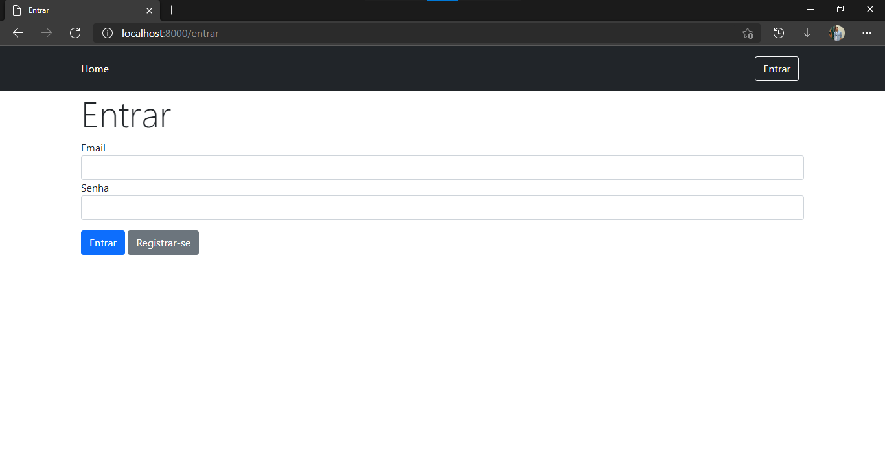
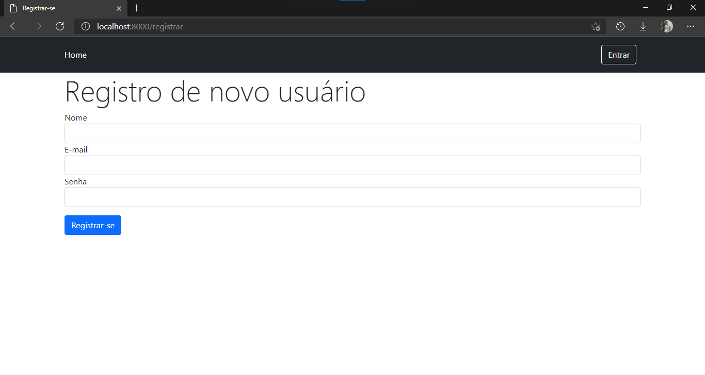
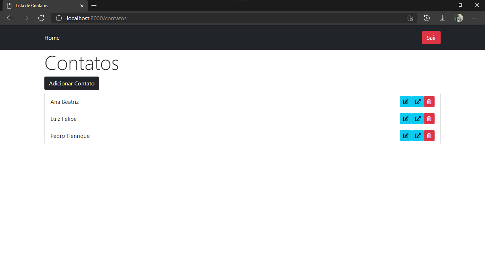
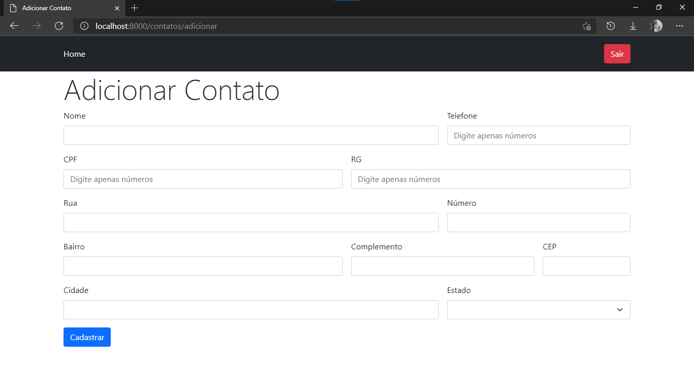
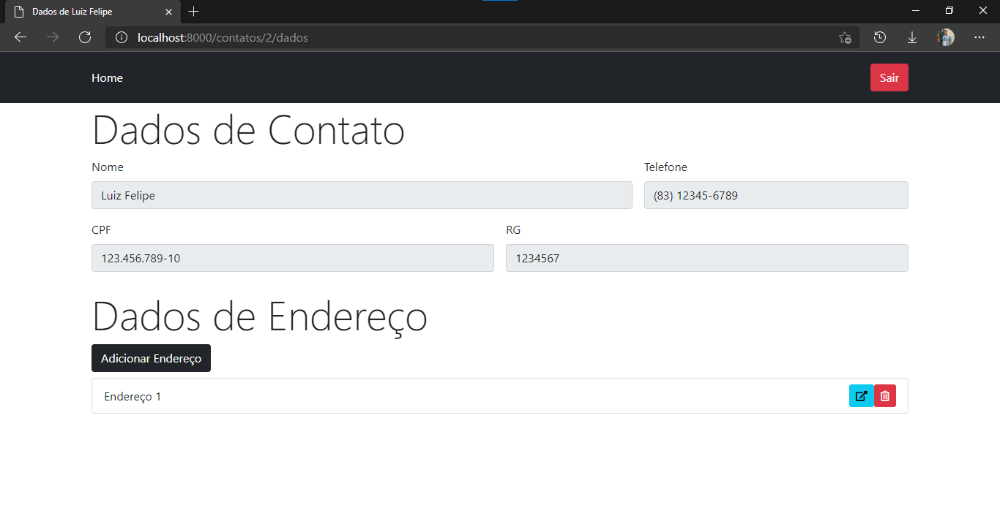

# ☎ Controle de Contatos
<p align="center">
  <a href="https://www.php.net">
    
  </a>
  <a href="https://laravel.com">
    
  </a>
</p>

<p align="justify">
  Projeto desenvolvido em PHP, usando o framework Lavarvel, para aplicar conceitos aprendidos ao longo da disciplina de Desenvolvimento de Aplicações WEB II, ministrada pelo Prof. Me. Danyllo Wagner Albuquerque, no 3º ano do Curso Técnico em Informática Integrado ao Ensino Médio, do IFPB - Campus Campina Grande, em 2020 e 2021.
</p>

## 🚀 Iniciando
1. É necessário ter uma versão de [PHP](https://www.php.net/ "Página inicial de PHP") instalada em sua máquina

2. Baixe o repositório
 - Usando Git
  ```
  https://github.com/TavaresJonatas/Controle-de-Contatos.git
  ```
  - Usando GitHub CLI
  ```
  gh repo clone TavaresJonatas/Controle-de-Contatos
  ```
  > 💡 ou da maneira que você preferir

3. Em um terminal, acesse o diretório do projeto e execute a aplicação
  ```
  php artisan serve
  ```
4. Acesse a aplicação em seu navegador através de [localhost:8000/contatos](http://localhost:8000/contatos "Página inicial")

## ⚡ Como Funciona
<p align="justify">
  Esta aplicação objetiva, a partir de um cadastro de usuário, criar, visualizar e editar contatos e suas respectivas informações.
</p>

<p align="center">
  <b>Figura 1</b> - Tela Inicial<br />
  <br />
  <b>Figura 2</b> - Tela de Registro<br />
  <br />
  <b>Figura 3</b> - Tela de Contatos<br />
  <br />
  <b>Figura 4</b> - Tela de Cadastro de Novo Contato<br />
  <br />
  <b>Figura 5</b> - Tela de Informações de Contato<br />
  <br />
</p>

## 💻 Equipe
<table>
  <tr align="center">
    <td><a href="https://github.com/TavaresJonatas" title="Jônatas Tavares"><br /><sub>Jônatas Tavares</sub></a></td>
    <td><a href="https://github.com/FtnLucas" title="Lucas Silva"><br /><sub>Lucas Silva</sub></a></td>
</table>

<!--
<p align="center"><a href="https://laravel.com" target="_blank"></a></p>

<p align="center">
<a href="https://travis-ci.org/laravel/framework"></a>
<a href="https://packagist.org/packages/laravel/framework"></a>
<a href="https://packagist.org/packages/laravel/framework"></a>
<a href="https://packagist.org/packages/laravel/framework"></a>
</p>

## About Laravel

Laravel is a web application framework with expressive, elegant syntax. We believe development must be an enjoyable and creative experience to be truly fulfilling. Laravel takes the pain out of development by easing common tasks used in many web projects, such as:

- [Simple, fast routing engine](https://laravel.com/docs/routing).
- [Powerful dependency injection container](https://laravel.com/docs/container).
- Multiple back-ends for [session](https://laravel.com/docs/session) and [cache](https://laravel.com/docs/cache) storage.
- Expressive, intuitive [database ORM](https://laravel.com/docs/eloquent).
- Database agnostic [schema migrations](https://laravel.com/docs/migrations).
- [Robust background job processing](https://laravel.com/docs/queues).
- [Real-time event broadcasting](https://laravel.com/docs/broadcasting).

Laravel is accessible, powerful, and provides tools required for large, robust applications.

## Learning Laravel

Laravel has the most extensive and thorough [documentation](https://laravel.com/docs) and video tutorial library of all modern web application frameworks, making it a breeze to get started with the framework.

If you don't feel like reading, [Laracasts](https://laracasts.com) can help. Laracasts contains over 1500 video tutorials on a range of topics including Laravel, modern PHP, unit testing, and JavaScript. Boost your skills by digging into our comprehensive video library.

## Laravel Sponsors

We would like to extend our thanks to the following sponsors for funding Laravel development. If you are interested in becoming a sponsor, please visit the Laravel [Patreon page](https://patreon.com/taylorotwell).

### Premium Partners

- **[Vehikl](https://vehikl.com/)**
- **[Tighten Co.](https://tighten.co)**
- **[Kirschbaum Development Group](https://kirschbaumdevelopment.com)**
- **[64 Robots](https://64robots.com)**
- **[Cubet Techno Labs](https://cubettech.com)**
- **[Cyber-Duck](https://cyber-duck.co.uk)**
- **[Many](https://www.many.co.uk)**
- **[Webdock, Fast VPS Hosting](https://www.webdock.io/en)**
- **[DevSquad](https://devsquad.com)**
- **[Curotec](https://www.curotec.com/services/technologies/laravel/)**
- **[OP.GG](https://op.gg)**

## Contributing

Thank you for considering contributing to the Laravel framework! The contribution guide can be found in the [Laravel documentation](https://laravel.com/docs/contributions).

## Code of Conduct

In order to ensure that the Laravel community is welcoming to all, please review and abide by the [Code of Conduct](https://laravel.com/docs/contributions#code-of-conduct).

## Security Vulnerabilities

If you discover a security vulnerability within Laravel, please send an e-mail to Taylor Otwell via [taylor@laravel.com](mailto:taylor@laravel.com). All security vulnerabilities will be promptly addressed.

## License

The Laravel framework is open-sourced software licensed under the [MIT license](https://opensource.org/licenses/MIT).
-->
